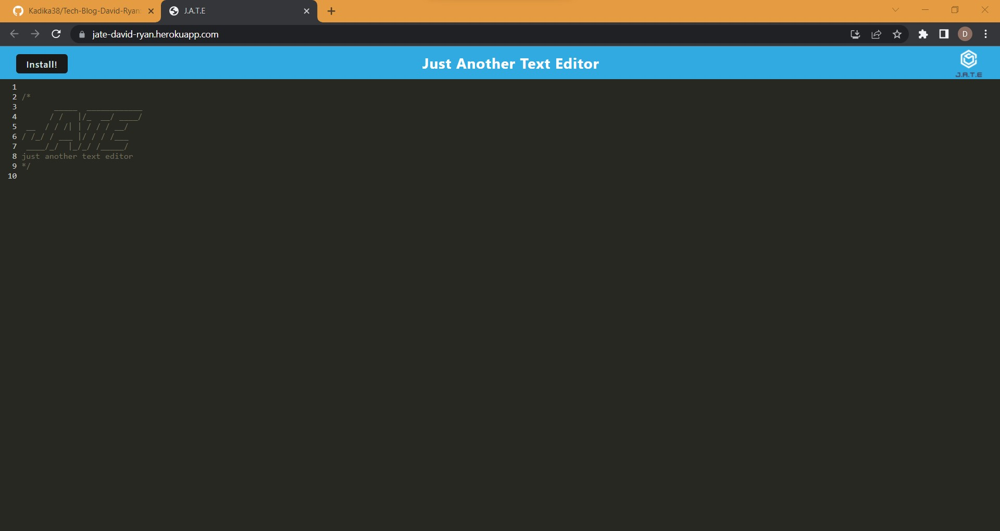

# PWA-Text-Editor-David-Ryan
Bootcamp Homework Assignment 19.  Single-page application that meets the PWA criteria. Additionally, it features a number of data persistence techniques that serve as redundancy in case one of the options is not supported by the browser or if the application is being run offline.

## Table of Contents
* [Description](#general-description)
* [Deplyment](#deployment)
* [Screensot](#screenshot)
* [License](#license)
* [Contributing](#contributing)
* [Tests](#tests)
* [Questions](#questions)
    
    
## Description
This is a demonstration of a PWA (Progressive Web Application).  It's a simple text editor.  What's special (and what makes it a PWA) is that it uses webpack and caching to run on new and older browsers, run without an internet connection, and offers the ability to install it as a standalone app on your device that runs exactly as well as it would on a browser.  It also makes use of an indexedDB.

## Deployment
Deployed using Heroku at https://jate-david-ryan.herokuapp.com.

## Screenshot

## License
This repository is not licensed.

## Contributing
This is just a bootcamp assignment.  No contributions.

## Tests
No tests were created for this project.

## Questions
Any questions?  Contact me on GitHub @ https://github.com/Kadika38 or email dryan10101@gmail.com.